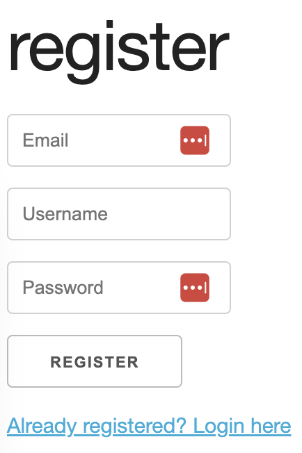

# Lokkeroom Application (1 December 2022)

>  ## Why I created this app?
> You have been asked by several sports club to create a platform so that team member could share message with their team, and their team only! Your platform would allow coaches from a team to create a message lobby. Once their lobby is created coaches (admin) can add users to their team so they can access the lobby.
> All information has to be stored in a PostgreSQL database.
> All the below features have to be implemented in the form of a REST API, this API should only return JSON not HTML!

> ## How does the interface look?
> 
